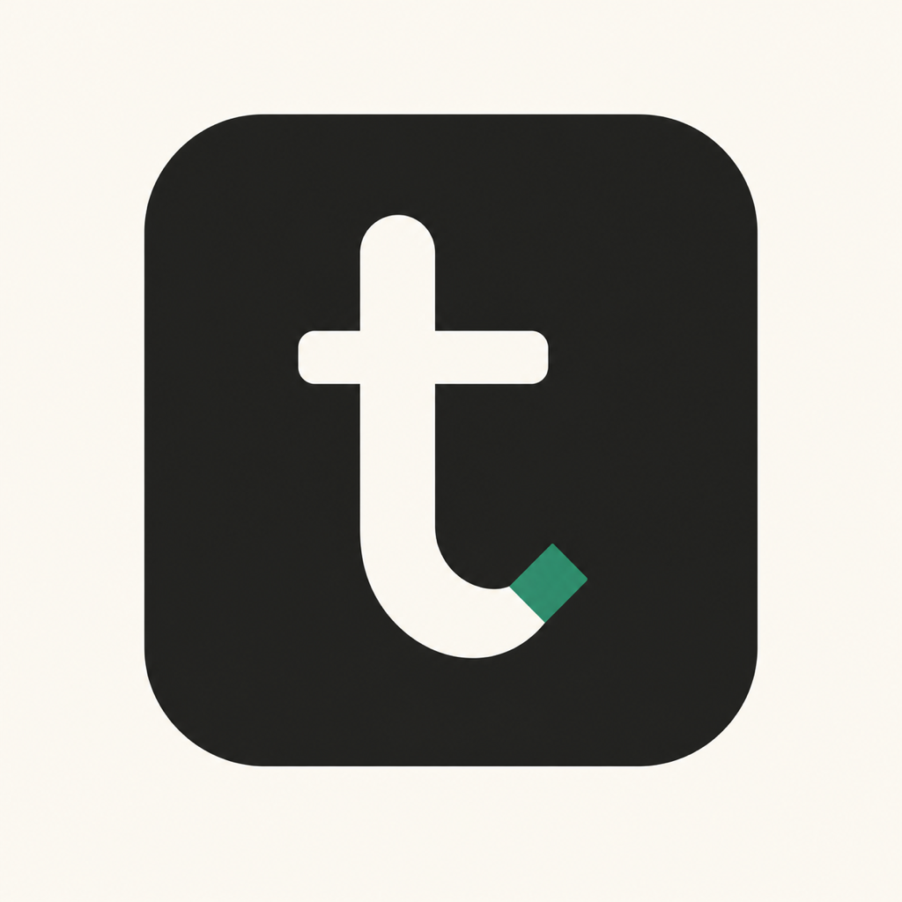
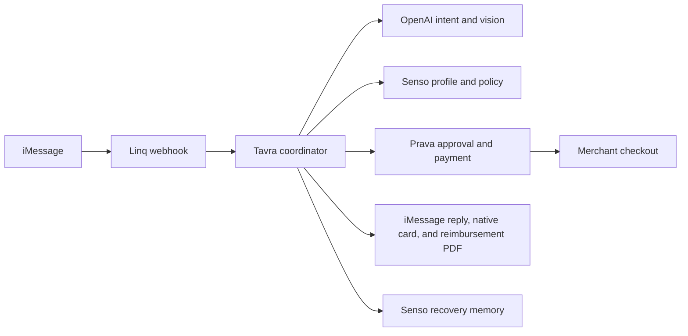

<p align="center">
  
</p>

# Tavra

**Travel recovery inside iMessage.**

Tavra helps a traveler recover from delayed baggage without making them search through stores, company policies, payment pages, and reimbursement forms on their own. The traveler sends a message or a photo of the baggage notice. Tavra gathers the missing details, finds an eligible product, asks for approval, handles the payment flow through Prava, and prepares the reimbursement evidence in the same conversation.

## The problem

A delayed bag creates a second job for the traveler at the worst possible time. They have to:

- Work out what they need and how quickly they need it.
- Find products that can reach the right address.
- Remember clothing sizes and company spending rules.
- Pay without exceeding the approved amount.
- Keep the notice, order details, receipt, and airline information for reimbursement.

Most travel tools stop after reporting the disruption. Tavra handles the recovery work that comes next.

## What Tavra does

The core flow is deliberately simple:

1. The traveler texts the Linq iMessage number or sends a baggage-delay notice as an image.
2. Tavra identifies the sender through a private phone-to-employee mapping.
3. Senso retrieves only that employee's profile, saved sizes, allowance, and relevant company policy.
4. OpenAI understands the message or image and helps Tavra ask one natural question at a time.
5. Tavra confirms the need, deadline, sizes, exact delivery address, and incident details.
6. Tavra presents the selected product, image, delivery information, and exact total in one review card.
7. The traveler approves by replying yes or reacting with a thumbs-up, then completes the Prava approval.
8. Tavra attempts merchant checkout, updates the same conversation, creates reimbursement evidence, and writes a safe recovery outcome back to Senso.

OpenAI helps with language and interpretation. Deterministic application code controls identity, state, prices, consent, payment, checkout, and all claims about what actually happened.

## System overview



## Hackathon integrations

| Technology | How Tavra uses it |
| --- | --- |
| **Linq** | Receives signed iMessage webhooks, sends replies and attachments, requests shared location, reads image attachments, accepts thumbs-up reactions as approval, shows typing state, and delivers the native `imessage_app` card. SMS and RCS are ignored. |
| **OpenAI** | Uses the Responses API for intent routing, structured recovery-turn interpretation, natural replies, and image understanding for baggage notices. Greetings use a fast path. The default reply model is `gpt-5-mini`, with `gpt-4o-mini` as the low-cost router. The model cannot set prices, approve purchases, or claim that checkout succeeded. |
| **Senso** | Retrieves employee data and policy context using exact allowlisted content IDs. The sender is resolved locally before Senso is queried, so Tavra never searches across employee profiles to guess an identity. After recovery, Tavra writes a small sanitized outcome back to that employee's Senso context for future conversations. |
| **Prava** | Creates approval for one exact purchase, waits for payment approval, retrieves the one-time credential, and attempts the reviewed merchant checkout exactly once. Sandbox mode records the expected test-card or insufficient-funds decline as capability evidence. Live mode uses Prava MCP and UCP for search, product details, quotes, payment status, and checkout. |

## What is unusual about this build

### A real iMessage app extension

Tavra includes a signed native Messages extension written in Swift. It opens inside Messages, renders an itemized Apple Wallet-like review, shows the selected product image, and follows the checkout status. Prava and issuer verification open in `SFSafariViewController` so the secure origin remains visible and protected.

The extension is optional. Without it, Tavra falls back to a normal secure link.

### Messaging primitives are part of the interface

- A baggage-notice image becomes structured incident evidence.
- A thumbs-up reaction can approve the exact summary it targets.
- An iMessage location share becomes an address proposal, never automatic purchase consent.
- A typing indicator shows when OpenAI work is in progress.
- A single app card is updated as the flow moves from review to approval to merchant result.
- The reimbursement packet is returned as a PDF attachment in the same chat.

### Stale replies cannot interrupt the conversation

Image reading, location retrieval, OpenAI, and payment polling finish at different times. Tavra gives every chat turn a revision, serializes work per chat, deduplicates Linq events, and drops an asynchronous reply if a newer message has already moved the conversation forward. Late image evidence can still be saved silently without sending an out-of-context response.

### AI for ambiguity, code for consequences

The model can understand phrases such as "looks good" or extract a baggage reference from an image. It cannot choose an unverified product, invent a delivery promise, spend money, or mark approval as an order. Every consequential state transition is checked in code and stored durably in SQLite.

### Product images are bound to the selected offer

Live product images come from the selected merchant result. Tavra validates the URL and content, then serves the image through a checkout-scoped proxy for the Messages extension. It does not ask an image model to invent merchant evidence.

## Quick verification for judges

These checks do not require access to the team's private credentials:

```bash
npm install
npm run typecheck
npm test
npm run build
npm run build:landing
```

On macOS with Xcode installed, also run:

```bash
npm run test:ios
```

To inspect the payment interface without sending an iMessage or creating a transaction:

```bash
npm run preview:payment
```

The preview is local and does not accept real card data.

### What to look for in the core demo

1. Send "My bag is delayed" or attach a baggage notice.
2. Confirm that Tavra does not invent a meeting, city, deadline, airline, or product need.
3. Ask for replacement essentials and provide the destination and deadline.
4. Confirm that saved employee facts come from the knowledge base and missing information is requested naturally.
5. Share a location or type an address, then confirm the complete delivery address.
6. Review the product and exact total in the iMessage card.
7. Approve with yes or a thumbs-up and complete the Prava step.
8. Confirm that the chat and card update with the real merchant outcome.
9. Confirm that the reimbursement PDF returns to the same chat and the recovery outcome is written back to Senso.

## Run Tavra with your own Linq number

### Requirements

- Node.js 22 or newer.
- A Linq Partner API V3 key and a provisioned Linq iMessage number.
- An OpenAI API key.
- A Senso API key and Senso content for an employee and the relevant policies.
- A public HTTPS address that forwards to local port `3000`.
- Prava sandbox credentials for the complete sandbox payment flow, or a Prava MCP account for live commerce.
- macOS and Xcode only if you want to install the native Messages extension.

### 1. Install and create local configuration

```bash
npm install
cp .env.example .env
cp senso/demo-config/identity-map.example.json senso/demo-config/identity-map.local.json
```

Open `.env` and set at least:

```dotenv
LINQ_API_KEY=your_linq_partner_api_key
LINQ_MODE=live
LINQ_FROM_NUMBER=+12025551234
PUBLIC_BASE_URL=https://your-public-host.example

OPENAI_API_KEY=your_openai_api_key
OPENAI_MODEL=gpt-5-mini
OPENAI_ROUTER_MODEL=gpt-4o-mini

SENSO_API_KEY=your_senso_api_key
SENSO_BASE_URL=https://apiv2.senso.ai/api/v1/
SENSO_IDENTITY_MAP_PATH=senso/demo-config/identity-map.local.json

TAVRA_COMMERCE_MODE=disabled
PORT=3000
```

`LINQ_FROM_NUMBER` is the provisioned Linq number. The private identity map contains the phone number of the person who will send messages to it.

Do not commit `.env`, the private identity map, local Senso profiles, payment credentials, or runtime databases. They are ignored by Git.

### 2. Prepare Senso

Upload the employee and policy Markdown files you want Tavra to use. Synthetic starter content is included under:

```text
senso/demo-corpus/employees/
senso/demo-corpus/policies/
senso/demo-corpus/merchants/
senso/demo-corpus/products/
senso/demo-corpus/outcomes/
```

Edit `senso/demo-config/identity-map.local.json` and replace every placeholder with:

- The sender's phone number in E.164 format.
- The employee ID.
- The exact Senso employee-profile content ID.
- The exact policy content IDs that employee may access.
- Any optional demo-context content IDs.

The identity map is private backend configuration. Do not upload it to Senso.

The employee profile can also be uploaded with the included helper:

```bash
cp senso/demo-corpus/employees/emp_demo_001.md senso/demo-config/employee-profile.local.md
npm run senso:sync-profile
```

This helper uploads only the employee profile and updates its content ID. Policy and optional demo-context IDs still need to be added to the private identity map.

### 3. Create a public HTTPS tunnel

Any HTTPS tunnel can forward to port `3000`. The included one-terminal workflow uses the Microsoft Dev Tunnel created by VS Code.

First, forward port `3000` once in VS Code's Ports view, make it public, and copy its HTTPS URL into `PUBLIC_BASE_URL` in `.env`. Then install and authenticate the CLI:

```bash
brew install --cask devtunnel
devtunnel user login -g
npm run tunnel:vscode:check
```

If you use another tunnel provider, keep that tunnel running separately and start Tavra with `npm run dev` instead of `npm run dev:imessage`.

### 4. Create the Linq webhook subscription

```bash
npm run linq:subscriptions
npm run linq:subscribe
```

The subscription is restricted to the configured Linq number and listens for:

- `message.received`
- `reaction.added`
- `location.sharing.started`
- `location.sharing.stopped`

Its target is:

```text
https://your-public-host.example/webhooks/linq?version=2026-02-03
```

When a new subscription is created, the command saves its signing secret to `.env` without printing it. If the subscription already existed, its original signing secret must already be present as `LINQ_WEBHOOK_SECRET`.

### 5. Choose the commerce mode

For conversation, Senso, image, location, and reimbursement testing without payment:

```dotenv
TAVRA_COMMERCE_MODE=disabled
```

For the hackathon sandbox payment and merchant capability flow:

```dotenv
TAVRA_COMMERCE_MODE=sandbox
PRAVA_API_KEY=pk_test_your_publishable_key
PRAVA_SECRET_KEY=sk_test_your_secret_key
PRAVA_MODE=sandbox
PRAVA_BACKEND_URL=https://sandbox.api.prava.space
PRAVA_CHECKOUT_MODE=hosted
```

Install the browser used for the merchant checkout attempt:

```bash
npx playwright install chromium
```

Sandbox completion means Tavra discovered the reviewed merchant product, created approval for that purchase, received the one-time credential, and attempted merchant checkout once. The merchant's expected test-card or insufficient-funds decline is evidence of the completed sandbox capability. It is not recorded as an order or reimbursable expense.

For live Prava MCP commerce:

```bash
npm run prava:link-commerce
```

After OAuth linking and saved-address setup, use:

```dotenv
TAVRA_COMMERCE_MODE=live
PRAVA_MCP_URL=https://mcp.pay.prava.space/mcp
```

Live mode requires `payments:read`, `payments:write`, and `checkout:run`.

### 6. Start Tavra

With the saved Microsoft Dev Tunnel:

```bash
npm run dev:imessage
```

This starts the Tavra server and tunnel together. Press `Ctrl+C` once to stop both.

Verify the server:

```bash
curl http://localhost:3000/health
curl https://your-public-host.example/health
```

Now send an iMessage from the phone number in the private identity map to the provisioned Linq number.

## Optional: install the native Messages extension

The text and secure-link flow works without the extension. Install it when you want the native product and approval card inside Messages.

```bash
brew install xcodegen
cp ios/TavraMessages/Config/Local.xcconfig.example ios/TavraMessages/Config/Local.xcconfig
npm run ios:messages:generate
open ios/TavraMessages/TavraMessages.xcodeproj
```

Before generating the project, edit `Local.xcconfig` with:

- Your registered app bundle ID.
- Your registered Messages extension bundle ID.
- Your 10-character Apple development team ID.
- The exact public Tavra checkout hostname, without a scheme or path.

In Xcode, select your signing team and connected iPhone, then run the `TavraMessages` scheme. Set the matching values in `.env` and restart Tavra:

```dotenv
TAVRA_MESSAGES_APP_TEAM_ID=YOURTEAMID
TAVRA_MESSAGES_APP_BUNDLE_ID=com.yourcompany.tavra.MessagesExtension
TAVRA_MESSAGES_APP_NAME=Tavra
```

## Useful integration checks

```bash
npm run smoke:openai
npm run smoke:senso-openai
npm run smoke:prava
npm run smoke:webhook
```

- `smoke:openai` makes one small OpenAI request without Linq.
- `smoke:senso-openai` exercises the multi-turn recovery logic with real Senso and OpenAI, without sending an iMessage.
- `smoke:prava` creates and revokes a sandbox Prava session.
- `smoke:webhook` verifies signed webhook handling and persistent deduplication against a running Tavra server.

The OpenAI and Senso smoke checks use real API credentials and may consume credits.

## Important truth and safety boundaries

- Payment approval is not treated as a merchant order.
- Tavra records an order only when the merchant confirms one.
- A sandbox test-card decline is recorded as a checkout attempt, not a purchase.
- Shared location proposes an address. The traveler must confirm the complete delivery address.
- Senso searches are restricted to the current employee's allowlisted content IDs.
- Payment credentials, OAuth tokens, complete addresses, and private employee mappings are kept out of chat, browser summaries, and OpenAI prompts where they are not required.
- Vercel deploys only the public landing page. The Linq webhook and Tavra backend require the Node server and a public HTTPS route.

## Hackathon originality declaration

Tavra, including its product concept, code, prompts, workflows, integrations, visual design, native iMessage extension, and demo assets, was created during the Prava Agentic Commerce Hackathon. No part of this project existed before the hackathon began.
